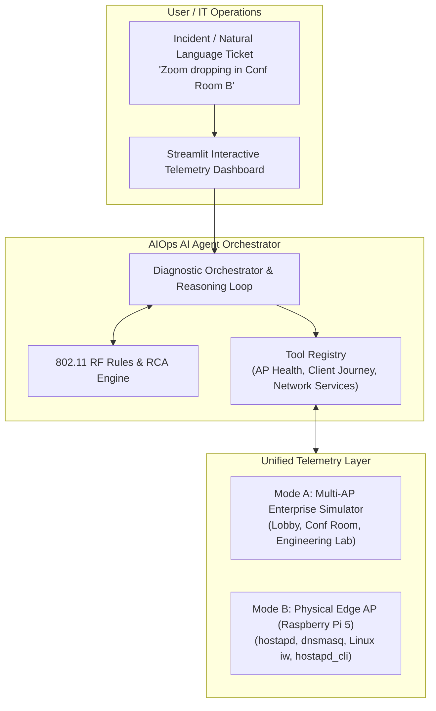

# 📡 Arooba-AIOps: Autonomous Wi-Fi Operations Copilot

[](https://github.com/iammana/arooba-aiops/actions)
[](https://www.python.org/)
[](https://opensource.org/licenses/Apache-2.0)
[](#)

> **Autonomous Network Operations & Telemetry Agent for Enterprise Wi-Fi.**  
> *Inspired by enterprise AIOps architectures, with dual support for Cloud Simulation and Physical Edge APs (Raspberry Pi 5).*

---

## 🌟 Executive Overview

In enterprise wireless networks, Wi-Fi incidents are notoriously ambiguous. A user submits a ticket saying:
> *"The Wi-Fi in Conference Room B is sluggish and Zoom calls keep dropping."*

Diagnosing this manually requires correlating:
1. **Client RF Telemetry:** RSSI signal strength, SNR, PHY bitrate, and 802.11 frame retry rates.
2. **Access Point Airtime:** Channel utilization, co-channel interference (CCI), and RF noise floor.
3. **Roaming & Mobility Events:** Detecting **Sticky Client Syndrome** (stations refusing to roam to a closer AP).
4. **Core Infrastructure Services:** 802.1X/RADIUS authentication, DHCP scope exhaustion, and DNS latency.

**Arooba-AIOps** bridges low-level wireless telemetry and autonomous AI agents. It investigates complaints, systematically executes diagnostic tools, determines the definitive Root Cause Analysis (RCA), and performs closed-loop remediation (e.g. 802.11v BSS Transition steering, dynamic channel switching, or DHCP lease recovery).

---

## 🏗️ Architecture



---

## ⚡ Key Highlights & Aruba-Competitive Feature Suite

* **Dual-Mode Deployment:**
  * **Simulation Mode:** Pre-loaded multi-AP campus deployment. Instant evaluation on any Mac/PC with **zero hardware**.
  * **Hardware Mode (Raspberry Pi 5):** Turns a Pi 5 into an actual Wi-Fi Access Point broadcasting an SSID, running real Linux `hostapd` / `dnsmasq`, and exposing live kernel 802.11 telemetry (`iw dev wlan0 station dump`).
* **Zero-Dependency Demo Guarantee:** Ships with an intelligent, deterministic rule engine that runs locally with **0 API keys required**, while seamlessly supporting **Google Gemini**, **OpenAI GPT-4o**, and **Anthropic Claude**.
* **Aruba Enterprise Competitive Features:**
  1. 📡 **Arooba AirMatch (Algorithmic RF Plan Optimizer):** Graph-coloring constraint solver that eliminates campus-wide Co-Channel Interference (CCI) by allocating orthogonal 2.4/5GHz channels and balancing radio Tx powers.
  2. 🗺️ **Visual RF & Campus Floorplan Heatmap:** 2D spatial RF canvas modeling signal propagation (Log-Distance Path Loss), AP coverage cells, live station links, sticky client roam vectors, and rogue threats.
  3. 🧪 **Synthetic UXI Probe Engine (Aruba UXI Equivalent):** Autonomous synthetic client journey sensor measuring 7 sequential link phases: 802.11 Assoc, 802.1X Auth, DHCP DORA, DNS query, Gateway ping, Cloud HTTP, and Throughput benchmarks.
  4. 🛡️ **WIDS / WIPS Rogue AP Threat Containment (RFProtect):** Detects unauthorized Rogue APs and Evil Twin corporate SSID spoofers, with one-click automated 802.11 deauthentication airtime containment.
  5. 📹 **Layer-7 AppRF & UCC Telemetry (Zoom / Teams):** Tracks Mean Opinion Score (MOS 1.0–5.0), packet jitter (ms), and UDP loss (%) for VoIP/video conferences correlated with L2 Wi-Fi frame retries.
  6. 📈 **Statistical Baseline Anomaly Detection (AI Insights):** Calculates Z-scores against rolling performance baselines to detect abnormal airtime utilization surges before tickets are filed.
* **Pre-Canned Incident Scenarios:**
  1. **Sticky Client Syndrome:** Client walked across the building but is stubbornly stuck to a distant 2.4 GHz AP at -83 dBm instead of a nearby Wi-Fi 6 AP (-46 dBm).
  2. **Co-Channel Interference (CCI):** Channel utilization surges to 91% due to airtime congestion.
  3. **Silent DHCP Exhaustion:** Wi-Fi link association succeeds, but station is trapped in `DHCP_DISCOVER_TIMEOUT`.
  4. **Rogue AP / Evil Twin Attack:** Unauthorized AP spoofing corporate SSID to harvest credentials in Conf Room B.
  5. **Zoom UCC Quality Degradation:** High RF retry rates causing jitter buffer overrun and robotic voice cutouts (MOS drops to 2.1).
  6. **Multi-AP Co-Channel Conflict:** All campus APs overlapping on identical channels, resolved via AirMatch optimization.
* **Automated Remediation:** Issues 802.11v BSS Transition Management frames, channel switch announcements (CSA), WIPS rogue containment, AirMatch RF re-plans, or DHCP pool lease purges.

---

## 🚀 Quickstart (30 Seconds)

### 1. Clone & Set Up Environment

```bash
git clone https://github.com/iammana/arooba-aiops.git
cd arooba-aiops

# Create virtual environment
python3 -m venv .venv
source .venv/bin/activate

# Install dependencies
pip install -r requirements.txt
```

### 2. Run the Interactive Web Dashboard

```bash
streamlit run ui/dashboard.py
```

The dashboard is configured (`.streamlit/config.toml`) to bind to `0.0.0.0:8501` with CORS/XSRF protection adjusted for external traffic:
* **Local Machine:** Open `http://localhost:8501`
* **LAN / Local Wi-Fi Devices:** Open `http://<HOST_IP>:8501` (e.g. `http://192.168.50.120:8501`) from any phone, laptop, or client connected to your home router or the Pi AP.
* **Public Internet (Remote Access):** Expose securely via:
  ```bash
  # Option A: ngrok
  ngrok http 8501

  # Option B: Cloudflare Tunnel (Zero-config)
  cloudflared tunnel --url http://localhost:8501
  ```

You can immediately:
* Inspect live AP airtime and client link tables.
* Inject an incident using the sidebar scenario dropdown.
* Run the AI Agent to watch real-time tool calls, RCA generation, and auto-remediation!

---

## 🍓 Raspberry Pi 5 Hardware Setup (Optional)

If you have a Raspberry Pi 5, you can turn it into an authentic Arooba-style Edge AP.

```
                    ┌───────────────────────────────┐
                    │     Raspberry Pi 5 (Edge)     │
                    │                               │
                    │   SSID: Arooba-AIOps-Lab      │
                    │   hostapd (802.11ac / 5GHz)   │
                    │   dnsmasq (192.168.4.1/24)    │
                    │   arooba-edge.service (:8000) │
                    └───────────────▲───────────────┘
                                    │ HTTP Telemetry & Control
                                    ▼
                    ┌───────────────────────────────┐
                    │      Laptop / Workstation     │
                    │                               │
                    │   Arooba-AIOps Copilot UI     │
                    └───────────────────────────────┘
```

### 1. Run Automated Setup on Pi 5 (Raspberry Pi OS Bookworm)

```bash
sudo bash edge/scripts/setup_pi_ap.sh
```

This automated script will:
* Install `hostapd`, `dnsmasq`, and `wireless-tools`.
* Configure static IP `192.168.4.1/24` on `wlan0`.
* Broadcast SSID **`Arooba-AIOps-Lab`** (WPA2 passphrase: `AroobaAiOps2026!`).
* Enable IP forwarding & NAT (routing Wi-Fi traffic out `eth0`).
* Launch the `arooba-edge` FastAPI daemon on port `8000`.

### 2. Connect Your Laptop to the Pi 5

In `ui/dashboard.py` (or your `.env` file), switch the source mode to **Physical Edge (Raspberry Pi 5)**:
```env
TELEMETRY_SOURCE=hardware
EDGE_AP_HOST=http://192.168.50.128:8000
```

Now, connect your smartphone or laptop to `Arooba-AIOps-Lab`. The AI Agent will read your phone's real RSSI, SNR, and PHY bitrate directly from the Pi 5's Broadcom wireless driver!

### 3. Switch Back to Client Mode (Home Wi-Fi)

To revert AP mode on your Pi 5 so it reconnects to your home router:
```bash
sudo bash edge/scripts/switch_to_client.sh
```
Then connect to your home Wi-Fi:
```bash
sudo nmcli dev wifi connect "YOUR_SSID" password "YOUR_PASSWORD"
```

---

## 🧪 Testing

Run the automated test suite verifying parsers, simulation models, and AI agent diagnostic loops:

```bash
pytest -v tests/
```

---

## 📂 Repository Layout

```text
arooba-aiops/
├── README.md                      # Documentation, architecture, and quickstart
├── LICENSE                        # Apache 2.0 License
├── requirements.txt               # Python dependencies
├── .env.example                   # Environment configuration template
├── .github/workflows/ci.yml       # GitHub Actions CI matrix
│
├── core/                          # AI Agent Core & Telemetry Client
│   ├── config.py                  # Environment config
│   ├── telemetry_client.py        # Unified interface (Simulator vs Hardware)
│   ├── tools.py                   # Diagnostic & Remediation tools
│   ├── prompts.py                 # Enterprise Tier-3 engineering prompts
│   └── agent.py                   # Multi-provider agent orchestrator
│
├── simulator/                     # In-Memory Multi-AP Campus Simulator
│   ├── models.py                  # Pydantic data schemas
│   └── engine.py                  # Wi-Fi state & scenario engine
│
├── edge/                          # Raspberry Pi 5 Edge Telemetry Daemon
│   ├── daemon.py                  # FastAPI service for hostapd/iw
│   ├── parsers.py                 # Linux 802.11 output parsers
│   ├── scripts/
│   │   ├── setup_pi_ap.sh         # One-click Pi 5 AP setup
│   │   ├── hostapd.conf.template  # 802.11ac AP configuration
│   │   └── dnsmasq.conf.template  # DHCP/DNS configuration
│   └── systemd/
│       └── arooba-edge.service    # Auto-start systemd service
│
├── ui/                            # Interactive Dashboard
│   └── dashboard.py               # Streamlit application
│
└── tests/                         # Pytest test suite
    ├── test_parsers.py            # Linux Wi-Fi text parsers
    ├── test_simulator.py          # State changes & scenarios
    └── test_agent.py              # Autonomous diagnostic loops
```

---

## 📜 License

Distributed under the [Apache 2.0 License](LICENSE).
